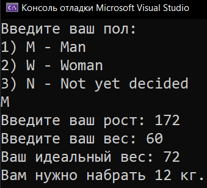
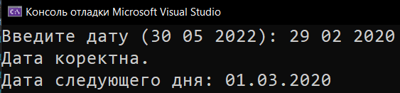
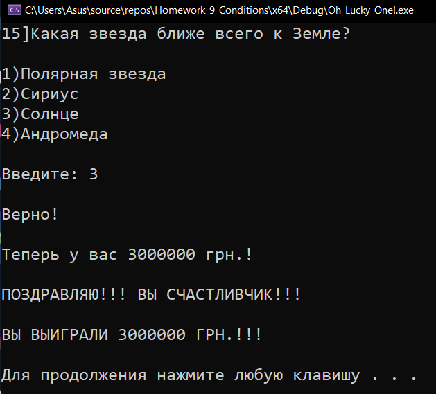
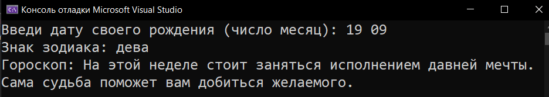

# Homework_9_Conditions
Д/з: Conditions

<a href="https://gist.github.com/SlavikArt/2ae2f1aac194243cf638071919a18679">Gist - страница со всеми кодами проектов</a>

* [Ideal_Weight_For_Height](Ideal_Weight_For_Height)
* [Is_Date_Correct](Is_Date_Correct)
* [Oh_Lucky_One!](Oh_Lucky_One!)
* [Your_Horoscope](Your_Horoscope)

    <h2>Ideal weight for height</h2>
    
Какой ваш идеальный вес?

    
    <h2>Is date correct</h2>
    
Проверка даты на корректность.

    
    <h2>Oh lucky one!</h2>
    
О, Счастливчик!

    
    <h2>Your horoscope</h2>
    
Твой гороскоп.

    

